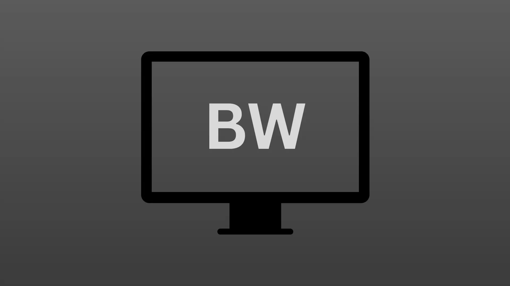
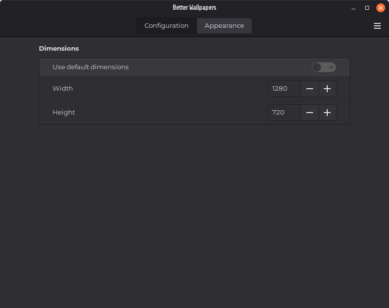
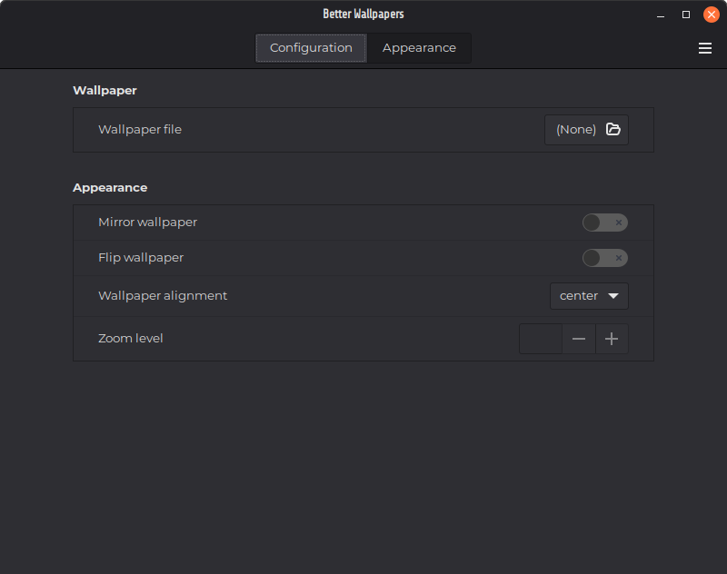

# Better Wallpapers by pb103938

A simple desklet for adding per-display wallpapers. 

## Setup

The desklet will have the following image as its default/fallback image:

This can be changed in the `Appearance` section of the desklet's settings.

Once added, it will be slightly off-center. Simply recenter it by turning off `Lock desklets in their current position` in `General Settings` in the **Desklets** app. Be sure to enable `Lock desklets in their current position` after positioning it as desired.

When configuring the desklet specifically, be sure that a portion of the screen beneath the desklet is visible when right-clicking it to ensure you see the configuration menu.

### Using Better Wallpapers with other desklets

This desklet is automatically set to the lowest position in the desklet hierarchy as possible. This means all other desklets will be displayed above it. If multiple of this desklet are added to the same monitor, the most recently added one will be displayed at the bottom. Because of this, **if you have multiple displays, you should add the ones you plan to put on other displays **first**.**

When moving the desklet to the desired monitor, it may end up displaying on top of other desklets. This can be fixed by simply reloading the desklet or by reloading cinnamon. 

## Using the Settings

The settings are split into two categories: `Configuration` and `Appearance`.

### Configuration Settings

The configuration page holds the settings for the dimensions of the wallpaper.

By default, the setting `Use default dimenions` is **enabled**. When **disabled**, the `Width` and `Height` settings appear. Their default values are `1280` and `720` respectively. Change these to the width and height of your display or to any value you would like. 

When `Use default dimensions` is **enabled**, it will use the dimensions of your default display. If another dislay does not have these same dimensions, you will have to disable **Use default dimensions** for that instance and set the dimensions of that display manually using the `Width` and `Height` values.

### Appearance Settings

The appearance page holds the settings for the appearance of the wallpaper.

There is no wallpaper file selected by default. It simply uses the fallback wallpaper above normally. Wallpapers can be the following file types:

- `.jpg`
- `.jpeg`
- `.png`
- `.webp`

Any other file type will result in the fallback wallpaper above being used. If you choose an unsupported file type by accident it will **not** break the desklet. Images which are not the exact dimensions of your screen can be used without issue. They will automatically be adjusted to fill the desklet without being stretch or compressed.

Enabling `Mirror wallpaper` will flip the wallpaper along the vertical axis.

Enabling `Flip wallpaper` will flip the wallpaper along the horizontal axis.

`Wallpaper alignment` and `Zoom level` are currently **non-functional**. They will be fully implemented in a future version.

## Found a bug? Want a feature?

Awesome! Submit an issue through the [cinnamon-spices-desklets GitHub page](https://github.com/linuxmint/cinnamon-spices-desklets/issues)! I'll be sure to fix it.

Alternatively, ping me in the [Linux Mint Discord server](https://discord.com/invite/mint) and I'll respond shortly afterwards. (username: @Exelegious).
