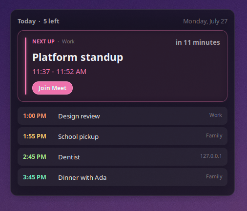

# Agenda

A Cinnamon desklet that keeps today's appointments where you'll actually see
them. Built for the forgetful.



The next thing you have to do gets the big card and a live countdown.
Everything else for the rest of today queues up underneath. Tomorrow stays out
of it.

## Install

Right-click the desktop → **Add Desklets** → **Download** tab → find
**Agenda** → install, then add it from the **Manage** tab.

## Add your calendars

Right-click the desklet → **Configure...**, and paste your ICS links into the
feed box, one per line:

```
https://example.com/basic.ics
Work | https://example.com/work.ics
webcal://example.com/team.ics
# lines starting with a hash are ignored
```

Up to ten feeds. Most calendar services publish a private ICS link somewhere in
their settings — Google calls it "Secret address in iCal format". Treat those
links like passwords; the desklet never logs one or shows it on screen, and its
cached copy of your calendar is readable only by you.

Once you have more than one calendar, each event gets tagged with where it came
from. That name is read from the feed itself, so it's usually right without you
doing anything; putting `Work |` in front of a URL overrides it.

## What it does

**Joins your meetings.** If an event has a video link, the card gets a join
button. Google Meet, Zoom, Teams, Webex, Jitsi, Proton Meet, kMeet, Whereby,
BlueJeans, GoTo, Chime, Meetecho, BigBlueButton, Jami, Discord and Slack are
recognised by name; anything else just says "Join meeting". The link is found
whether the organiser used a proper conference field or simply pasted it into
the location or the description.

**Adapts to its size.** Drag the width down and it folds into a compact
column; widen it and durations, locations and calendar names appear. Width,
text scale and density all live under **Size and layout**.

**Keeps working offline.** Feeds are cached, so a restart or a dropped
connection shows the last known agenda and tells you it's doing so. If a
calendar can't be reached it says so rather than quietly claiming your day is
empty.

**Stays out of the way.** Eight soft neon colours walk down the day, each
checked against the background so it never costs you legibility. Turn the
opacity down for more wallpaper, up for more contrast.

## Worth knowing

- Feeds refresh every five minutes by default. The countdown ticks faster as an
  appointment approaches and idles when the day is quiet.
- **Only show the join button within** hides join buttons until a call is
  close, if you'd rather they weren't there all day. A meeting already running
  always shows its link.
- Cinnamon only pushes settings to a running desklet through its own settings
  window. Editing the JSON in `~/.config/cinnamon/spices/agenda@ashex/` by
  hand won't take effect until Cinnamon restarts.

## For developers

```
agenda@ashex/
  info.json                 spice metadata for the website
  screenshot.png
  README.md
  tests/                    test suites
  files/agenda@ashex/       what actually gets installed
    desklet.js              rendering and lifecycle
    settings-schema.json
    po/                     translation template
    lib/ical.js             iCalendar reader and recurrence expansion
    lib/agenda.js           decides what to show
    lib/meeting.js          finds and identifies video meeting links
    lib/theme.js            neon palette and Fluent surface rules
    lib/feeds.js            fetching and the on-disk cache
    lib/format.js           times, ranges, countdowns
    lib/i18n.js             translation setup
```

Everything outside `desklet.js` is free of toolkit code, which is what makes it
testable without a running shell:

```sh
cjs-console agenda@ashex/tests/run-ical-tests.js
cjs-console agenda@ashex/tests/run-agenda-tests.js
cjs-console agenda@ashex/tests/run-meeting-tests.js
```

222 tests covering recurrence and daylight saving, meeting link extraction and
host spoofing, layout decisions, and the contrast guarantee.

### Translations

Strings are bound to this desklet's own gettext domain, so they resolve
independently of Cinnamon's catalogue. The template lives in
`files/agenda@ashex/po/`. To refresh it after changing any user-visible
string, run the spices helper from the repository root:

```sh
./cinnamon-spices-makepot agenda@ashex
```

### Calendar support

The bundled reader handles the parts of RFC 5545 that real feeds actually use:
folded lines, escaped text, `TZID` zones (including the Windows names Exchange
emits), all-day dates, `DTEND` or `DURATION`, and recurrence via `DAILY`,
`WEEKLY`, `MONTHLY` and `YEARLY` with `INTERVAL`, `COUNT`, `UNTIL`, `BYDAY`
(including `2TU` and `-1FR`), `BYMONTHDAY`, `BYMONTH`, `BYSETPOS` and `WKST`.
`EXDATE`, `RDATE` and `RECURRENCE-ID` overrides work, as do `STATUS`, `TRANSP`
and attendee `PARTSTAT` for filtering. Calendar names come from RFC 7986 `NAME`
or the older `X-WR-CALNAME`.

Recurrence is expanded only across the window on screen, so a daily meeting
created thirty years ago costs the same as one created yesterday. Repeating
events keep their wall-clock time across daylight saving transitions.

### A note on meeting links

Everything before an `@` in a URL is a username, not a host — so
`https://meet.google.com:x@evil.com/` goes to `evil.com`. Links are parsed with
a real URL parser rather than pattern matching, credentials and backslashes are
refused outright, and only `http`/`https` are ever opened. They're handed to
the system URI handler, never a shell, so nothing from a calendar feed can
reach a command line.
