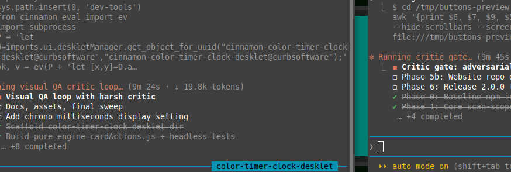

# Color Timer Clock

A Cinnamon desklet with three cards (**Clock**, **Timer** and **Chronometer**) whose background colors follow a schedule you define. Each card's color ramps between (time, color) stops: the clock by time of day wrapping over midnight, the timer by time remaining, the chronometer by time elapsed.

## Why this exists

The color is not decoration. It's the signal. Each card has a job:

- The **clock** shows when AI providers run their low-traffic discounts. Set the color stops to match the window, and you know at a glance when it's cheap to run.
- The **timer** counts down to credit resets, so I know when my API credits come back.
- The **chronometer** runs sprints. Most of the work happens in the last stretch before a deadline, so the color tells me where I am in the sprint: green for the first half hour, amber sliding to red over the next hour and a half, blue once two hours are up. Blue means take a break.

One glance tells me the state of things. That's the whole idea.

## Features

- Up to three side-by-side cards; show or hide each one
- Per-card color schedules with smooth (interpolated) or stepped transitions
- Clock card with an optional IANA timezone
- Timer with on-card play/pause, reset and ±60 s buttons; survives restarts and expires correctly even after downtime
- Optional desktop notification when the timer finishes
- Optional notifications when the clock or chronometer reaches a schedule stop
- Chronometer with pause/resume; the accumulated time survives restarts, and an optional hundredths display (20 updates/s while running)
- Text and border colors adapt to the card background for readability (WCAG contrast ratio)
- Tooltips on every card control
- A per-card refresh button to reload settings without interrupting a running timer or chronometer
- A next-colour swatch on each card that previews the upcoming schedule colour
- One-click "Reset all schedules to defaults"

## Configuration

Right-click the desklet → **Configure…**

- **Color schedules**: a list of (time, color) stops per card. Colors are hex (`#rgb`, `#rgba`, `#rrggbb`, `#rrggbbaa`) or a name (`red`, `blue`, …). Duplicate times keep the last row; invalid rows are dropped with a log line
- **Smooth color transitions**: blend gradually between stops, or hold each color and jump at the next stop
- **Show a notification when the timer finishes**: pops a desktop notification when the countdown reaches zero
- **Notify (per schedule row)**: tick a clock or chronometer schedule row's Notify checkbox to pop a notification when that time is reached
- **Timer minutes / seconds**: the default duration the timer restarts from
- **Refresh (per card)**: the small button in each card's top-right corner reloads that card's settings without restarting a running timer or chronometer
- **Next-colour swatch (per card)**: the small circle in each card's bottom-right corner previews the next schedule colour and snaps to it at the breakpoint
- **Show hundredths of a second**: adds a `.ss` fraction to the chronometer while it runs
- **Time / date format**: `strftime` patterns for the clock card
- **Maximum font sizes, card spacing, desklet width / height**: cards shrink text to fit

## Notes

Colors interpolate piecewise-linearly in RGB, so a red→blue ramp passes through purple. The clock schedule wraps over midnight; timer and chronometer schedules hold the last stop's color beyond it. Cards share the desklet width and each needs about 130 px. When the width cannot fit them all, the chronometer and then the timer hide automatically (a note is logged) and return when the desklet is widened.

UUID: `cinnamon-color-timer-clock-desklet@curbsoftware`

## License

GNU General Public License v2.0 or later. See [LICENSE](LICENSE).
