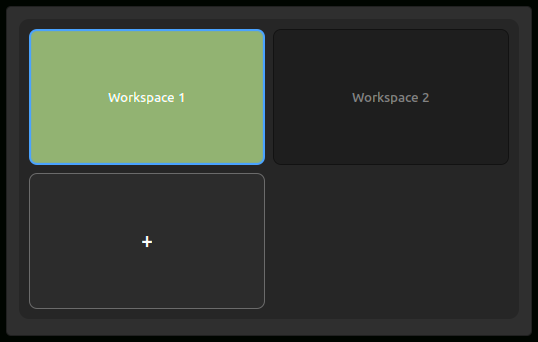

# Workspace Grid

A Cinnamon desklet that shows a clickable grid of workspaces on the desktop. It displays workspace names, highlights the active workspace, and can add, rename, or remove workspaces.

## Why this exists

I run a handful of VMs, each on its own workspace, each full-screen on two monitors with virt-viewer. My third screen is the control desk. The place I actually sit.

When I want a VM, I want it now. One click on its workspace and it's there. No Expo, no memorized shortcuts, no hunting through the switcher. Like Simon Says: I point at the workspace I want, and the grid takes me there.

This desklet is that grid.

## Features

- Left-click a tile to switch to that workspace
- Click the trailing **+** tile to add a workspace (up to 36)
- Right-click a tile to rename or remove it
- Optional index prefix on names (for example `1. Web`)
- Live updates when workspaces change from Expo, the panel switcher, or another xlet
- Optional scroll-wheel switching by row or column
- Layout, spacing, and size are configured from Cinnamon Desklet settings

## Configuration

Right-click the desklet → **Configure…**

- **Grid layout mode**: auto (near-square) or fixed rows × columns
- **Prefix names with index**
- **Allow adding, removing and renaming workspaces**: turn off for a read-only grid
- **Show a "+" tile**
- **Confirm before removing a named workspace**
- **Scroll wheel switches workspaces**: off, by column, or by row
- **Tile spacing** and **desklet width / height**

## Notes

This desklet does **not** replace Cinnamon's workspace switcher applet, and it does not remap keyboard shortcuts. It can run next to the panel switcher. It is not the same spice as the [Workspace grid (2D) and switcher](https://cinnamon-spices.linuxmint.com/applets/view/116) applet (`workspace-grid@hernejj`), which rearranges workspaces into a 2D grid and changes keybindings.

UUID: `cinnamon-workspace-grid-desklet@curbsoftware`

## License

GNU General Public License v2.0 or later. See [LICENSE](LICENSE).
