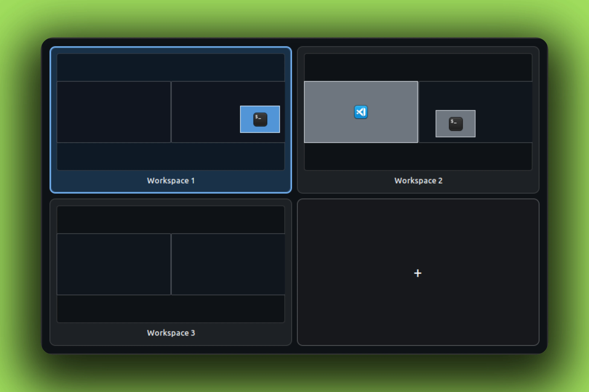
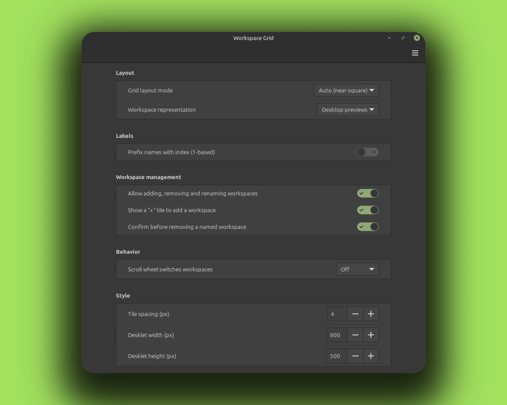

# Workspace Grid Desklet

Workspace Grid provides a named, clickable workspace grid on the desktop.
Choose simple name tiles or desktop previews showing visible windows and app
icons. Both modes retain workspace names and active workspace highlighting.

## Screenshots



The settings window:



## Features

- One clickable tile per workspace
- Name tiles or graphical desktop previews with every connected monitor
- Live unobscured window, focus, monitor, workspace, and name updates
- Auto or fixed-column layout
- Fixed layouts expand rows so no workspace is hidden
- Optional add tile and per-workspace rename or remove menu
- Filtered, throttled row or cell scroll switching
- Keyboard focus, tooltips, and accessible names

## Settings

Right-click the desklet and choose Configure.

- Grid layout mode, fixed rows, and fixed columns
- Names or desktop previews
- Optional numeric name prefix
- Workspace editing controls
- Scroll wheel behavior
- Tile spacing and desklet size

## Testing

```sh
gjs dev-tools/test-workspace-actions.js
python3 dev-tools/live-test-desklet.py
```

UUID: `cinnamon-workspace-grid-desklet@curbsoftware`

Licensed under GNU GPL v2.0 or later. See [LICENSE](LICENSE).
