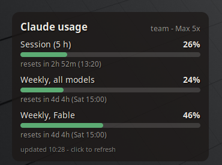

# Claude Usage

Unofficial Cinnamon desklet that shows your Claude plan usage on the desktop:

- the 5-hour session window
- the weekly window across all models
- any per-model weekly window your plan has (for example a separate bar for one model)
- extra-usage spend, if that is enabled on your account

Each bar shows the percentage used and when it resets. Bars turn amber at 70 %
and red at 90 %, or earlier if Anthropic flags the limit.

## Requirements

- [Claude Code](https://code.claude.com) installed and logged in on this machine
  (`claude` then sign in). The desklet works with Pro, Max and Team plans.
- Cinnamon 5.4 or newer.

## How it works

Claude Code stores an OAuth access token in `~/.claude/.credentials.json` when
you log in. The desklet reads that file (read-only, it never writes to it) and
calls `https://api.anthropic.com/api/oauth/usage`, the same endpoint that the
`/usage` command inside Claude Code uses. The token is sent to
`api.anthropic.com` and nowhere else. No other network requests are made.

The desklet watches the credentials file, so when Claude Code refreshes the
token the desklet re-fetches within a few seconds. It also polls every
2 minutes by default (configurable). Left-click refreshes immediately.

### Token expiry

The access token is short-lived and is refreshed by Claude Code itself whenever
you use it. If the desklet shows "Token expired", run any `claude` command and
the desklet will pick up the new token automatically. The desklet deliberately
does not refresh the token on its own, to avoid logging Claude Code out.

## Settings

Right-click the desklet and choose **Configure**:

- refresh interval
- width, text size, background opacity
- show or hide reset times
- show or hide extra-usage spend
- path to the credentials file (only needed if you moved your Claude config)

## Privacy

Your token and usage numbers stay between your machine and Anthropic. Nothing is
logged, cached to disk, or sent anywhere else.

## Disclaimer

This is a community project and is not affiliated with or endorsed by
Anthropic. "Claude" is a trademark of Anthropic, PBC.

## License

GPL-3.0-or-later. See the header of `desklet.js`.
