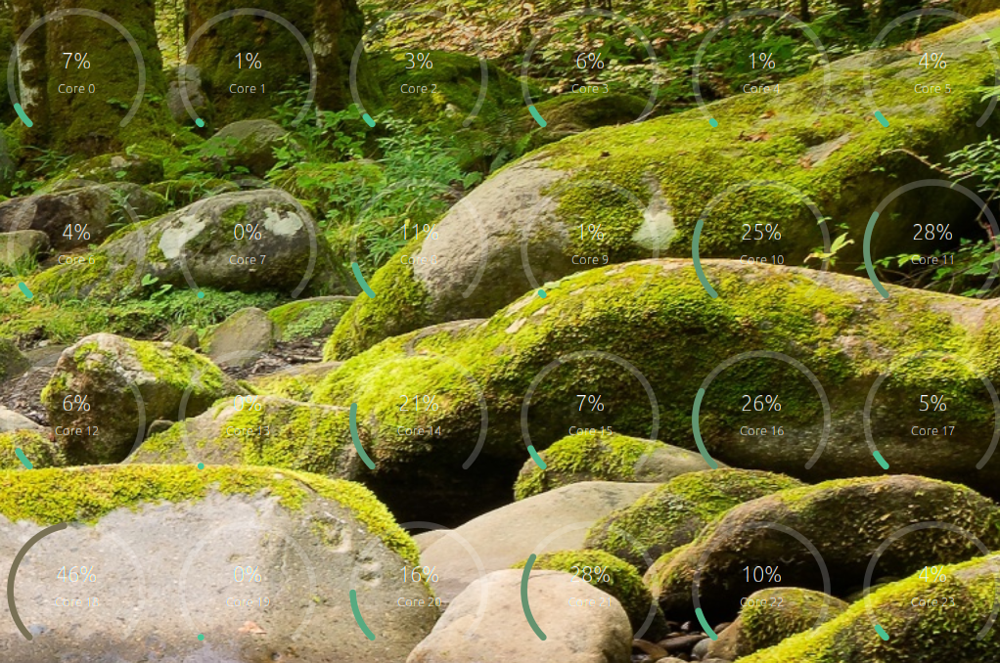
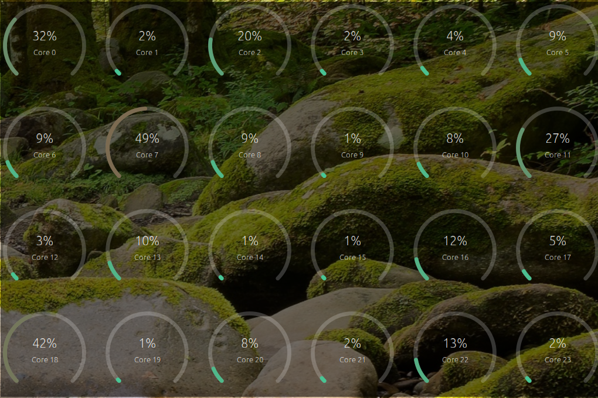
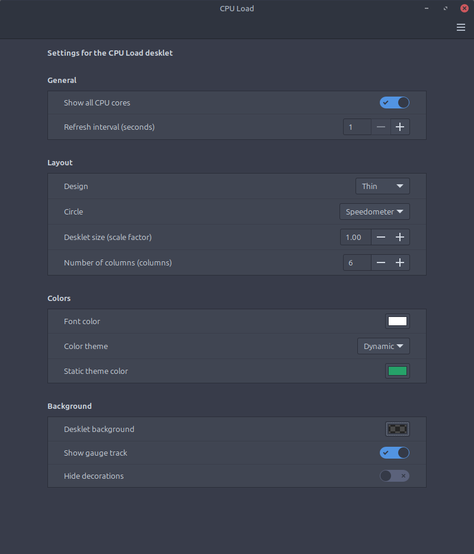

# CPU Load desklet for Cinnamon

Displays CPU utilization per core - now with optional background opacity setting.

Fork of Cinnamon Desklet [cpuload@kimse](https://github.com/linuxmint/cinnamon-spices-desklets/tree/master/cpuload%40kimse)

## What I added:
1. A new `desklet-background-color` entry in `settings-schema.json`, using the same `colorchooser` widget type your `font-color` and `static-theme-color` settings already use. That widget's picker has an alpha slider built in, so one control gives you both color *and* transparency - no separate opacity slider needed. Default is `rgba(0,0,0,0)` (fully transparent), so existing users see no change until they pick a color.
2. A `refreshBackground()` method in `desklet.js` that sets `this.content.style = "background-color: " + this.desklet_background_color + ";"` - same pattern your code already uses for `font-color` in `getTextLabelStyle()`.
3. Wired it to run once at startup and again whenever settings change (`on_setting_changed`), so picking a new color updates in real time.
4. I also gave `show-background` a clearer label ("Show gauge track") and a tooltip, since it's easy to confuse with the new setting.

You can see all the changes in [`desklet-background-color.patch`](./desklet-background-color.patch).

Screenshots:

