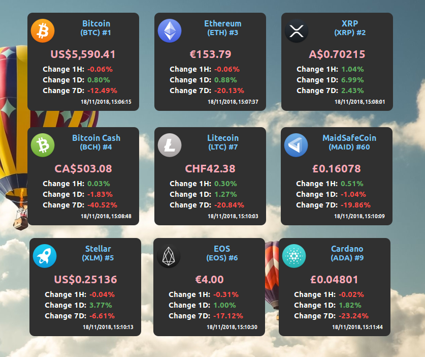

## Cryptocurrency Ticker (Desklet) for Cinnamon Desktop

Cryptocurrency Ticker (Desklet) for Cinnamon Desktop that displays the current price for **thousands of cryptocurrencies**, and their daily percent changes.

The official website for news and updates about this Cryptocurrency Ticker: https://cryptocurrencyticker.xyz/



## Usage Help

#### Installation

**To use the Desklet first you need to install it from the Desklets window, steps are below:**

1. Go to your desktop and click the right mouse button
2. From the menu select the `Add Desklets` option
3. Select the tab `Available Desklets(online)`
4. Find the `Crypto Coins Ticker` Desklet, you can use the search bar
5. Mark it for installation and click the button in the left bottom corner

*NOTE: It is also possible to install the Desklet manually by copying the `files/cryptocoins@pbojan` folder to `~/.local/share/cinnamon/desklets/` but it is recommended to use the steps above to always get the latest version!*

#### Usage

**To add the Desklet to your desktop, please follow the steps below:**

1. Select again the `Add Desklets` option
2. Find the `Crypto Coins Ticker` Desklet in the list
3. Select it and click `Add to desktop` button

*NOTE: You can add up to 10 different instances of the Desklet and select different coins for them!*

#### Configuration

**To configure the Desklet, please follow the steps below:**

1. Click the right mouse button while hovering on the Desklet
2. Select `Configure` from the menu
3. The config menu will appear where you should be able to change the following:
    - Your CoinMarketCap API key (you can get free at https://pro.coinmarketcap.com)
    - What kind of cryptocurrency to be displayed on the ticker (Symbol or Coin ID)
    - In what currency the price should be displayed (EUR, USD, AUD)
    - The refresh interval when to get new data

*NOTE: The ticker refreshes by default every 30 minutes. Every refresh uses one credit per coin ticker, plan you montlhy credits limit accordingly!*

##### Adding Custom Icon

The desklet comes with more than 1000 icons bundled but if you use a cryptocurrency that doesn't have an icon you can add a custom icon following these steps:

1. Go to the installed location of your desklet e.g. `.local/share/cinnamon/desklets/cryptocoins@pbojan/images/icons/`
2. Copy your icon to that folder usually 128x128 pixels
3. Make sure the name of the icon is the SYMBOL name of the cryptocurrency and is a PNG format e.g. `btc.png`

##### Using Coin ID

In same rare cases the Cryptocurrency Symbol is not unique e.g. BTCV so you can use the CoinID to specify the exact Cryptocurrency you want to display.
To find the correct Coin ID for your cryptocurrency you can execute the following in your terminal:

```
-- Replace YOUR_API_KEY with your key and BTCV with the cryptocurrency symbol you are looking for.
curl --header 'X-CMC_PRO_API_KEY: YOUR_API_KEY' https://pro-api.coinmarketcap.com/v1/cryptocurrency/map | json_pp | grep BTCV -A 10 -B 10
```

This command will return all cryptocurrencies that are using the same SYMBOL from which you can get the id and use it to configure the Coin ID in the desklet.

## Bugs/Feedback

If you find any bugs or stability issues please create an issue [here](https://github.com/pbojan/cryptocoins-desklet-cinnamon/issues) or email [p.bojan@live.com](mailto:p.bojan@live.com).

If you have ideas for new features or improvements please email [p.bojan@live.com](mailto:p.bojan@live.com).

## Contribute/Donate

If you want to support the work and maintenance of this Cryptocurrency Ticker, please consider donating. Every donation is highly appreciated!

```
BTC: bc1q82zg96fgeenr5ag254lnqt4nn77lzjf5nx9m00
BCH: qq57wcmp7ajgpzgxhme5ldfwwfmkja8qd5mmaf6rlz
LTC: ltc1q362me09lmxfcq6zex6968qsnnq6hz3nhxv4cyr
ETH: 0x1125207ae7d169eb623fa228e5b2c48a6b6482d9
```

**Can't donate, but you still want to help? Here are a few ways how to support this project:**
* Give feedback, report any bug or issue you find
* Improve the Desklet by creating a pull request to add new features. If you want to add new features please first email [p.bojan@live.com](mailto:p.bojan@live.com) and describe your idea.
* Star/Watch the project on GitHub
* Spread the word and share this desklet with your friends, colleagues, social networks, etc. 

## Credits

1. The Desklet currently is using the PRO API from: https://coinmarketcap.com/
2. The icons are from: https://github.com/cjdowner/cryptocurrency-icons
