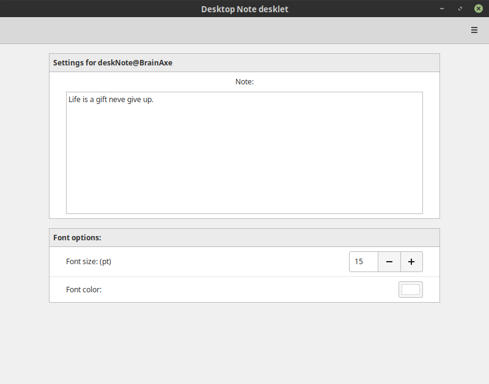

#  Desktop Note Cinnamon Desklet #

v0.1 - October 2, 2017

This desklet displays a note on the desktop. Right click it to configure at any time.

## Configuration Options ##

The following options are configurable via the Cinnamon Desklet GUI by right clicking "Desktop Note desklet" 
and choosing Configure.

- New Note
- Font size
- Font color

For newline use %% (symbol).

**Important**: Cinnamon may need to be restarted and/or the desklet may need to be removed and re-added 
for this change to take effect. 

 