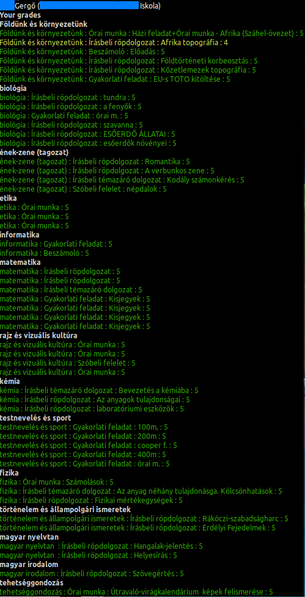
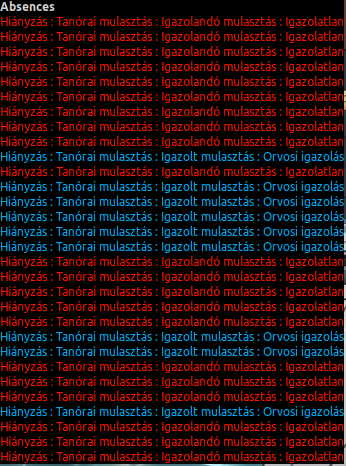
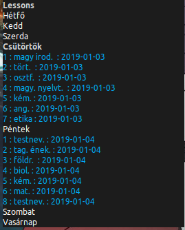

# eKreta@thegergo02
  

## Features
* Automated data reload
* When changing settings, you don't need to reload the desklet.  
* Displaying your subject averages
  * Grouping by subject categories,
  * Coloring your subject by their average (+ Customise the grade ranges),
  * Displaying class averages,
  * Compare your averages to class averages.  

* Displaying your grades
  * Group by subject,
  * Color your grades by their value,
  * Display details about your grades.  

* Display your absences
  * Color by their type,
  * Display every detail.  

* Timetable/Lessons
  * See your next lesson,
  * The current is is displayed in bold.  
  

## Coming Features
* Better UI
* Tabs
  * Display everything it can fetch from the KRETA servers.
* Translate to other languages (especially to Hungarian)

## Screenshot

## Changelog

### v0.1.2-alpha
* Added absences.
* Optimized http request. (For example, I added gZip)
* More organized code.
* Now you can change settings without the need of reloading the desklet.

### v0.0.1 (Alpha)
* First release! :+1:
* Display your subject's grade average
* A major code refactor
* Implemented mainloop
