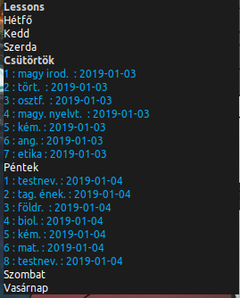

# eKreta@thegergo02

## Funkciók
* Automatikus adat lekérés
* Tantárgy átlagok kijelzése
  * Tantárgy kategóriák által való csoportosítás,
  * Tantárgyak kiszínezése átlag alapján (+ Az osztályzatok tartományának testreszabása),
  * Osztály átlag megjelenítése,
  * A te és az osztályod átlagának összehasonlítása.

## Fejlesztésben lévő funkciók
* A beállítások megváltoztatása után nem kell a deskletet újratölteni.
* Új kinézet
* Fülek
  * Minden adat kijelzése az KRETA szerverekről. (Hiányzások,jegyzetek,órarend...)
* Más nyelvekre való fordítás (Főleg magyarra...)

## Képernyőkép

## Changelog

### v0.0.1 (Alpha)
* Első kiadás! :+1:
* Tantárgyak átlagának kijelzése
* A kód refactorolva
* Mainloop implementálva
