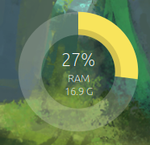

# Memory Load Desklet

A Linux Mint Cinnamon desklet that displays RAM and Swap usage with a circular gauge.



## Features

- Display RAM or Swap usage
- Circular gauge with multiple designs (thin, compact, thick)
- Customizable colors
- Configurable text display (used/total, free/total, etc.)
- Scalable size
- Optional decorations

## Installation

### From Cinnamon Spices (coming soon)

Search for "Memory Load" in Desklets settings.

### Manual Installation

```bash
cd ~/.local/share/cinnamon/desklets/
git clone https://github.com/Speeko/MemoryLoadDesklet.git
ln -s MemoryLoadDesklet/files/memload@spekks memload@spekks
```

Then right-click your desktop → Add Desklets → Memory Load

## Configuration

Right-click the desklet → Configure to access settings:

- **Display type**: RAM or Swap
- **Refresh interval**: 1-30 seconds
- **Design**: Thin, Compact, or Thick
- **Size**: Scalable from 0.4x to 5x
- **Colors**: Random or custom circle color
- **Text**: Various display options

## License

MIT License

## Credits

Design inspired by [diskspace@schorschii](https://cinnamon-spices.linuxmint.com/desklets/view/25) and [cpuload@kimse](https://cinnamon-spices.linuxmint.com/desklets/view/32).
