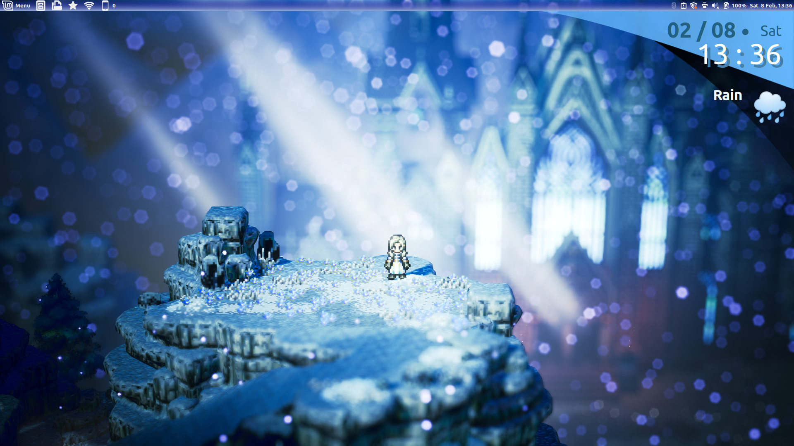

# Moonlight Clock for Cinnamon

A multipurpose display for current date, time, weather, and/or custom important events.

## Features
- Two separate lines to display the current date and/or time,
  fully customizable via strftime
- Weather information via WeatherAPI,
  including current temperature and daily chance of rain
  *(requires you to make an account and get an API key)*
- Display one or more countdowns to any important dates of your choosing
  to keep yourself organized
- Moon phase display, including a countdown to the next full moon
  *(with optional extra precision, see "Installation")*
- Last but not least, tweak the appearance to your liking: color, size, font, ...

## Screenshots
<!-- TODO must become https://cinnamon-spices.linuxmint.com/git/desklets/<UUID>/<REPO-PATH> -->

 
Default look after enabling WeatherAPI. The default font depends on your system configuration.

 
A few example customizations that can be made with the desklet's settings.

 
Configuration that replicates the inspiration material as closely as possible.

[Click here to get any of the configurations shown above.](https://github.com/torchipeppo/p3-clock-for-cinnamon/tree/master/custom_compendium) All featured fonts are free, and either commonly found by default on Linux Mint machines or available on Google Fonts. 

## Installation
Download or clone this repo, then put the `moonlight-clock@torchipeppo` directory
(contained in the `files` directory) into `~/.local/share/cinnamon/desklets/`

[Optional: run the Python script from my personal repo to generate more precise
data for the moon phases](https://github.com/torchipeppo/p3-clock-for-cinnamon/tree/master/lunar_calendar_generation)

### Design goals
1. Combine the style of the UI from the video game "Persona 3" and
   Linux/Cinnamon conventions into an effectively useful desktop widget
2. Provide value to as many users as possible
3. Keep the option to stay close to the source material, wherever this doesn't
   conflict with the above points

## Bug reports, feature requests, and contributions
Feel free to open issues or pull requests on the Cinnamon Spices repo
or my personal one!

## Compatibility
Developed, tested and extensively used by the author on Cinnamon 5.0.7 and Cinnamon 6.0.

Likely to work in near-future versions. May also work in some previous versions,
but it's untested there, so there's no guarantee.
