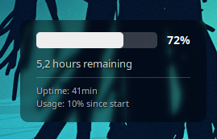

# Simple Battery Desklet for Cinnamon

A minimalist, highly customizable battery desklet for the Cinnamon desktop environment. It provides essential power metrics at a glance without cluttering your workspace.

 

*(Note: Upload a screenshot of your desklet to your repo and replace this link!)*

## ✨ Features

* **Minimalist Design:** A sleek horizontal progress bar and compact text.
* **Real-Time Status:** Shows the exact battery percentage and time remaining (or time until fully charged).
* **Session Tracking:** Calculates how much battery percentage you have consumed (or charged) since you turned on the PC.
* **System Uptime:** Displays how long your current session has been running.
* **Customizable Appearance:** Turn the semi-transparent background on/off and adjust the opacity directly via Cinnamon's desklet settings.
* **Multi-Language Support (i18n):** English and German are included by default. Easily expandable to other languages.

## 📦 Installation

### Manual Installation via Git
1. Open your terminal.
2. Clone this repository directly into your Cinnamon desklets folder:
   ```bash
   git clone [https://github.com/suckatcoding-com/simple-battery-desklet.git](https://github.com/suckatcoding-com/simple-battery-desklet.git) ~/.local/share/cinnamon/desklets/simple-battery@local
   ```
3. Restart Cinnamon so it detects the new desklet. Press Alt + F2, type r, and press Enter.
4. Right-click your desktop, select Add Desklets, go to the Manage tab, and add "Simple Battery" to your desktop.

## ⚙️ Configuration

You can easily configure the desklet to match your desktop theme:

1. Right-click the desklet on your desktop.
2. Select Configure (the gear icon).
3. Toggle the background visibility or adjust the background opacity using the slider. Changes are applied instantly.

## 🌍 Translations (i18n)

This desklet supports Gettext for translations. The base language of the code is English.

Want to add your language?

1. Create a new .po file in the main directory (e.g., fr.po for French) and translate the msgid strings.
2. Create the locale folder for your language:
   ```bash
    mkdir -p locale/fr/LC_MESSAGES
    ```
3. Compile the .po file into a .mo file using msgfmt:
    ```bash
    msgfmt po/fr.po -o locale/fr/LC_MESSAGES/simple-battery@suckatcoding.com.mo
    ```
4. Restart Cinnamon.
5. Feel free to open a Pull Request to share your translation with everyone!

## 📜 License
This project is licensed under the Apache 2.0 License - see the LICENSE file for details.