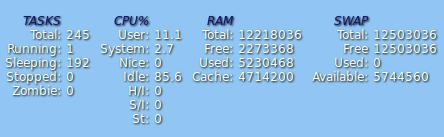

Top Desklet
===========
 Displays the output from the `top` command as a nicely formatted [desklet](https://cinnamon-spices.linuxmint.com/)

UUID: top@ryannerd

developers: [[Ryan Jentzsch](https://github.com/RyanNerd)]

translators: []

Screenshot:

**TODO**:
 - User configuration options:
    - Fix issue where desklet restart is needed when number of processes is changed.
    - Give users more control over the look and feel of the desklet (title colors, etc.)
 - Language Translations
    - I need to figure out how all this "po" stuff works.
    - Spanish (I may be able to bribe my co-worker Pablo into helping)

[See also](https://github.com/RyanNerd/gnome-autocomplete)