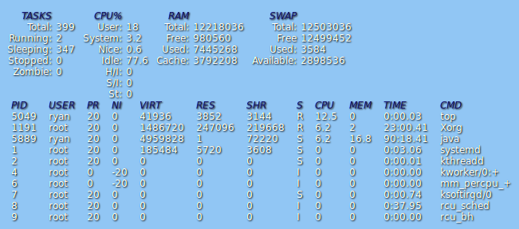

Top  Desklet 
===========
Displays the output from the `top` command as a nicely formatted [desklet](https://cinnamon-spices.linuxmint.com/)

UUID: top@ryannerd

developers: [[Ryan Jentzsch](https://github.com/RyanNerd)]

translators: []

Screenshot:

Compatability: 
- Linux Mint 20.1+
- Cinnamon 4.8+

I need assistance in the development of `top@ryannerd`:
- [ ] Translation to other languages (currently only English)
- [ ] Feature requests and issues as indicated on [Github](https://github.com/linuxmint/cinnamon-spices-desklets/issues?q=is%3Aissue+is%3Aopen+top%40ryannerd)

For additional resources developing desklets and applets:
[Auto complete for IDEA based IDEs for desklet development](https://github.com/RyanNerd/gnome-autocomplete)