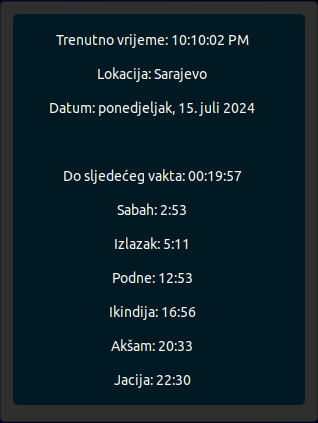

# Vaktija Desklet

## Table of Contents
- [Overview](#overview)
  - [How It Works](#how-it-works)
  - [Features](#features)
  - [Screenshot](#screenshot)
- [Usage](#usage)
- [Configuration](#configuration)
- [Links](#links)
- [Author](#author)

## Overview

Vaktija Desklet is a simple desklet that displays prayer times using data from the vaktija.ba API.

### How It Works

- The desklet displays current prayer times for a given location.
- Data is fetched from the vaktija.ba API and updated in real-time.

### Features

- Displays prayer times for the selected location.
- Real-time data updates.

### Screenshot

## Usage

1. Add the Vaktija Desklet to your desktop via the "Add Desklets" menu.
2. The desklet will automatically fetch and display prayer times for the default location.
3. Configure the desklet’s settings, including location, appearance, and other preferences, through the settings menu. This allows you to customize the desklet to suit your needs and preferences.

## Configuration

Currently, the desklet supports 177 locations across Bosnia and Herzegovina and southern Serbia. Future versions will include additional configuration options and more locations.

## Links

- Website - [Vaktija Desklet](https://sehic.rf.gd/?project=vaktija)
- Vaktija API - [Vaktija API](https://vaktija.ba/)

## Author

- LinkedIn - [@Muhammed Šehić](https://www.linkedin.com/in/muhammed-%C5%A1ehi%C4%87-31a7b6175/)
- GitHub - [@MuxBH28](https://github.com/MuxBH28)
- Website - [www.sehic.rf.gd](https://sehic.rf.gd/)
- Contact - [Contact](https://sehic.rf.gd/#contact)
