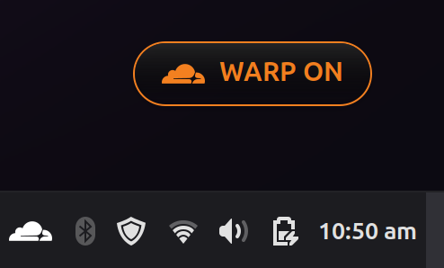

# WARP Toggle Desklet

A Linux Mint desklet to toggle Cloudflare WARP connection status directly from your desktop.

## Screenshots

|       Default (With Frame)        | Clean Look (Toggleable)  |
| :-------------------------------: | :----------------------: |
|  |  |

## Prerequisites

- **Cloudflare WARP CLI**: You must have `cloudflare-warp` installed and configured on your system.
  - Install via: `sudo apt install cloudflare-warp` (Instructions vary by distro)
  - Register the client: `warp-cli register`

## Installation

### Manual Installation

1. Download the `warp-toggle@mrbean.dev.zip` release.
2. Extract the contents.
3. Copy the `warp-toggle@mrbean.dev` folder (the one inside `files/`) to `~/.local/share/cinnamon/desklets/`.
   ```bash
   cp -r files/warp-toggle@mrbean.dev ~/.local/share/cinnamon/desklets/
   ```
4. Enable the desklet from **System Settings > Desklets**.

### From Spices (Future)

1. Open **System Settings > Desklets**.
2. Go to the **Download** tab.
3. Search for "WARP Toggle" and install.

## Usage

- **Click** the desklet to toggle between Connected and Disconnected states.
- **Right-Click** for advanced options:
  - **Toggle Connection**: Alternative way to switch states.
  - **View Logs**: Opens Cinnamon's 'Looking Glass' debugger to check connection times and errors.
  - **Toggle Decorations**: Show/Hide the window frame. (Tip: Show the frame to move the desklet, then hide it for a clean look).
- The desklet checks the status every 5 seconds.

## Troubleshooting

- **Nothing happens when clicking**:
  - Open a terminal and run `warp-cli connect` to see if there are any errors (e.g., TOS agreement pending).
  - Ensure the user has permission to run `warp-cli`.
- **Status says "Error"**:
  - Your WARP client might not be registered. Run `warp-cli register`.

## License

MIT
