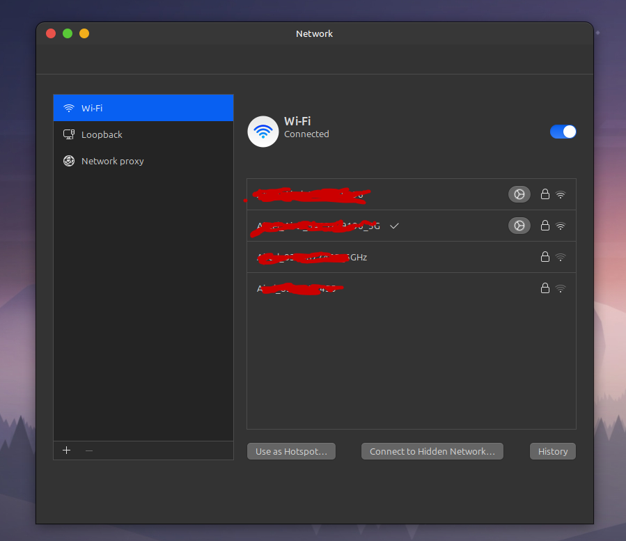

# Wi-Fi Desklet

A minimal Cinnamon desklet that displays a Wi-Fi icon and opens the **Network Settings** when clicked.

---

## 🖼 Preview



---

## 📦 Features

- Displays a clean Wi-Fi icon on the desktop.
- Clicking the icon opens the **Cinnamon Network Settings**.
- Designed to be minimal, distraction-free, and customizable with your own icon (`wifi.png`).

---

## 📂 Files

| File            | Purpose                               |
|-----------------|----------------------------------------|
| `desklet.js`    | Main logic for the desklet             |
| `metadata.json` | Desklet metadata (name, description)   |
| `wifi.png`      | Icon displayed on the desktop          |
| `README.md`     | This documentation file                |

---

## 🛠 Usage

1. Place the folder `wifi@SarangShelke2304` in:

``` ~/.local/share/cinnamon/desklets/```

2. From the Cinnamon **Desklets** settings, add **Wi-Fi Desklet** to your desktop.

3. Optionally replace `wifi.png` with your preferred icon, keeping the same filename.

---

## 💡 Notes

- This desklet does not monitor connection status — it's a launcher for quick access to network settings.
- Future improvements could include showing the connected SSID or signal strength.

---

## 🧑‍💻 Author

**Sarang Shelke**  
[https://github.com/SarangShelke2304](https://github.com/SarangShelke2304)

---

## 📜 License

MIT License — Free to use, modify, and share.


