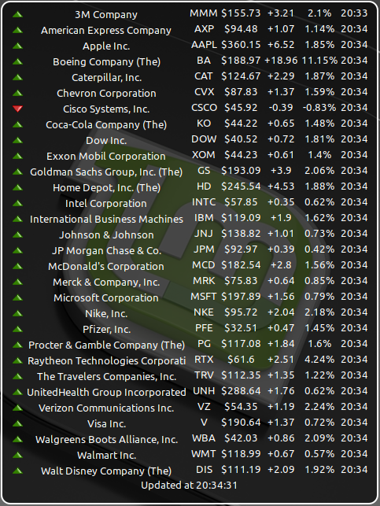

# Cinnamon Desklet for Yahoo Finance quotes

## Description

This repository contains a [desklet for the Cinnamon desktop environment](https://cinnamon-spices.linuxmint.com/desklets) that displays financial market information provided by [Yahoo Finance](https://finance.yahoo.com/).

This desklet is based on the [desklet from fthuin](https://github.com/fthuin/yahoofinance-cinnamon-desklet). The data retrieval part is adopted to an alternative service url, after the Yahoo Finance community table got retired in May 2017.

Tested with

- Linux Mint Cinnamon 17 up to 21
- Debian 9 with Cinnamon 3.2
- Manjaro with Cinnamon 3.8
- Fedora 38 Cinnamon Spin with Cinnamon 5.6 and libsoup3

## Installation

Either follow the installation instructions on [Cinnamon spices](https://cinnamon-spices.linuxmint.com/desklets), or manually download the folder **yfquotes@thegli** (below "files") and copy the folder and its content to `~/.local/share/cinnamon/desklets/`

## Configuration

Check out the desklet configuration settings, and choose the data refresh period, the list of quotes to show (see also [Known Limitations](#known-limitations)), and quote details to display. The default list contains the Dow 30 companies.

## Release Notes

### 0.8.7 - July 19, 2023

Features:

- add setting to include a User-Agent header in Yahoo Finance Quotes API requests
- update Hungarian translation (courtesy of [KAMI911](https://github.com/KAMI911))

### 0.8.6 - June 5, 2023

Bugfixes:

- fix libsoup3-specific code

### 0.8.5 - May 25, 2023

Bugfixes:

- adapt to recent changes in Yahoo Finance Quotes API

### 0.8.4 - May 8, 2023

Features:

- new setting to select the version of Yahoo Finance Quotes API
- update Danish translation (courtesy of [Alan01](https://github.com/Alan01))
- update Hungarian translation (courtesy of [KAMI911](https://github.com/KAMI911))
- update Italian translation (courtesy of [Dragone2](https://github.com/Dragone2))

### 0.8.3 - September 15, 2022

Bugfixes:

- add support for libsoup3 (courtesy of [fredcw](https://github.com/fredcw))

### 0.8.2 - June 8, 2022

Bugfixes:

- check timer reference before calling Mainloop.source_remove()

### 0.8.1 - May 16, 2022

Features:

- update Brasilian and German translations
- fetch finance data asynchronously to improve responsiveness

Bugfixes:

- do not color percentage change value when corresponding setting is not selected
- increase default desklet width
- update screenshot image
- fix syntax errors in README.md

### 0.8.0 - January 12, 2022

Features:

- add Russian translation (courtesy of [sulonetskyy](https://github.com/sulonetskyy))

### 0.7.0 - January 10, 2022

Features (courtesy of [sulonetskyy](https://github.com/sulonetskyy)):

- add symbolic trend change icons instead of .svg
- add configurable trend change colors instead of hardcoded colors
- add configurable strict rounding
- add UAH and RUB currency symbols
- change table items view (text align to the left, numbers/dates align to the right)

### 0.6.0 - June 18, 2021

Features:

- change layout of settings dialog to tabbed views
- new setting to use alternative colors (use blue instead of green)
- add Hungarian translation (courtesy of [KAMI911](https://github.com/KAMI911))

### 0.5.2 - February 7, 2021

Features:

- add Italian translation (courtesy of [Dragone2](https://github.com/Dragone2))
- add Korean translation (courtesy of [chaeya](https://github.com/chaeya))
- optimize png files (courtesy of [NikoKrause](https://github.com/NikoKrause))

Bugfixes:

- correct a msgid in translation files

### 0.5.1 - December 20, 2020

Features:

- incorporate Danish translation (courtesy of [Alan01](https://github.com/Alan01))

Bugfixes:

- update DOW 30 component symbols
- resolve various issues reported by Codacy

### 0.5.0 - October 4, 2020

Features:

- new setting to color percentage change according to trend. Enabled by default if percentage change is displayed. Courtesy of [plaihonen](https://github.com/plaihonen).
- new setting to add Yahoo Finance hyperlink to symbol/quote. Enabled by default if symbol is displayed. Proposed by [ngaro](https://github.com/ngaro).
- new setting to use long version for verbose quote name. Enabled by default if verbose name is displayed. Courtesy of [ngaro](https://github.com/ngaro).

### 0.4.2 - September 20, 2020

Bugfixes:

- update translation files with new setting
- extend desklet description for better searchability

### 0.4.1 - August 18, 2020

Features:

- add setting to disable quote name hyperlink

Bugfixes:

- remove invalid quote symbol from default list

### 0.4.0 - July 17, 2020

Features:

- allow multiple desklet instances
- add German translation

### 0.3.0 - June 29, 2020

Features:

- add setting to sort quotes list
- update DOW 30 component symbols

Bugfixes:

- auto-retry in case of connection problem (e.g. TLS handshake)

### 0.2.0 - May 23, 2018

Features:

- show absolute price change amount
- show last trade time/date
- show timestamp of latest data refresh
- add setting to configure rounding rule
- make background transparency configurable
- quote name links to Yahoo Finance details page
- display severe errors such as network failure

Bugfixes:

- improve error handling

### 0.1.0 - May 6, 2018

Features:

- minor description adjustments in configuration settings

Bugfixes:

- fix "value "nan" of type 'gfloat' is invalid or out of range for property" errors logged in *.xsession-errors*
- works (again) with Cinnamon 3.2

### 0.0.1 - May 4, 2018

Features:

- setting to show/hide the currency symbol

Bugfixes:

- change data retrieval to alternative url from Yahoo Finance

## Known Limitations

- The quotes list might not be editable using the desklet's configuration dialog (encountered in Cinnamon 3.6 and earlier 3.x versions). As a workaround, export the configuration using the standard desklet settings menu to a (json) file, then edit the file with your favorite text editor, and finally import the configuration file again.

## Credits

Based on the desklet source code from [fthuin](https://github.com/fthuin/yahoofinance-cinnamon-desklet).

## License

GNU General Public License v3.0
