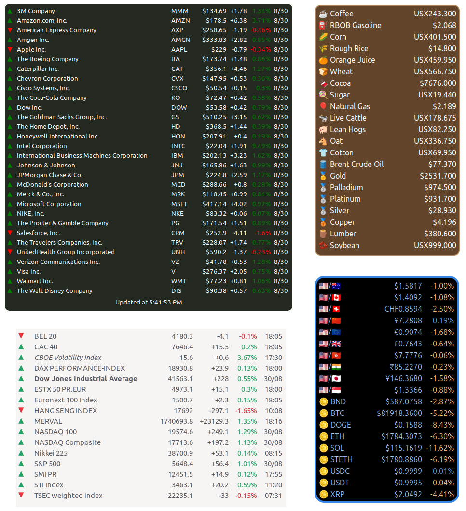

# Cinnamon Desklet for Yahoo Finance quotes

## Description

This repository contains a [desklet for the Cinnamon desktop environment](https://cinnamon-spices.linuxmint.com/desklets) that displays financial market information provided by [Yahoo Finance](https://finance.yahoo.com/).



This desklet is based on the [desklet from fthuin](https://github.com/fthuin/yahoofinance-cinnamon-desklet). The data retrieval part is adopted to an alternative service url, after the Yahoo Finance community table got retired in May 2017.

Tested with

- Linux Mint Cinnamon 17 up to 22
- Debian 9 with Cinnamon 3.2
- Manjaro with Cinnamon 3.8
- Fedora 38 Cinnamon Spin with Cinnamon 5.6 and libsoup3

## Installation

Either follow the installation instructions on [Cinnamon spices](https://cinnamon-spices.linuxmint.com/desklets) (recommended), or manually download the directory **yfquotes@thegli** (below "files") and copy the directory and its content to `~/.local/share/cinnamon/desklets/`

## Configuration

Check out the desklet configuration settings, and choose the data refresh period, the list of quotes to show, and quote details to display. The default list contains the Dow 30 companies.

> Note that **any changes in the quotes list are not applied immediately** (anymore). This is true for manual changes as well as for import settings from a file.  
Press the "Refresh quotes data" button to execute an immediate data update, or wait until the next automatic refresh is triggered (depending on the configured interval).

### Individual Quote Design

By default, all quotes in the list are rendered in the same style and color, following whatever settings are active and selected.  
Optionally, the *name* and the *symbol* of each quote can have a custom design. These individual design settings override the global settings. They are configured with a set of text properties within the quotes list.

The design properties are appended to the quote symbol in the format `property=value`. Each property/value pair is separated by a semicolon. Also insert a semicolon between the quote symbol and the first property. The order of the properties is irrelevant.  
The full syntax: `SYMBOL;property1=value1;property2=value2`

The following table explains all supported properties:

| Property | Values | Description |
|---|---|---|
| color | any CSS color value | Text color for name and symbol |
| name | any text, except ';' | Custom name, overrides the original short/long name |
| style | normal, italic, oblique | Font style for name and symbol |
| weight | normal, bold, bolder, lighter, 100 - 900 | Font weight (thickness) for name and symbol |

Some examples:

```text
CAT;color=#f6d001;weight=500
CSCO;name=Cisco;weight=bold;color=#00bceb
HD;color=#f96300
MMM;name=Post-It Makers;color=#ff0000
IBM;name=Big Blue;color=blue;weight=bolder
KO;name=Bubbly Brown Water;style=oblique;weight=lighter;color=#e61a27
```

## Troubleshooting

Problem: The desklet fails to load data, and shows error message "Status: 429 Too Many Requests".  
Solution: Enable option *Send custom User-Agent header* found on the first tab "Quotes" in the configuration settings.

### Debug Logging

**Only enable debug logging in case of problems, and when you know why you need it!**

The log output goes to the standard file `~/.xsession-errors`. All log messages produced by this desklet contain "yfquotes@thegli", so we can filter by this text. By default, the desklet logs only abnormal situations.

Significantly more log output can be generated when the *debug log* mode is active.  
To activate the debug log mode, create an empty file "DEBUG" in the desklet installation directory, e.g. with the command `touch ~/.local/share/cinnamon/desklets/yfquotes@thegli/DEBUG`  
Then the Cinnamon desktop needs to be restarted in order to re-initialize the desklet. This can be done by pressing *Ctrl-Alt-Esc*, or by logout/login.

To disable the debug log mode, delete the "DEBUG" file, and restart the Cinnamon desktop.

## Release Notes

See [CHANGELOG](CHANGELOG.md)

## Credits

Based on the desklet source code from [fthuin](https://github.com/fthuin/yahoofinance-cinnamon-desklet).

## License

GNU General Public License v3.0
